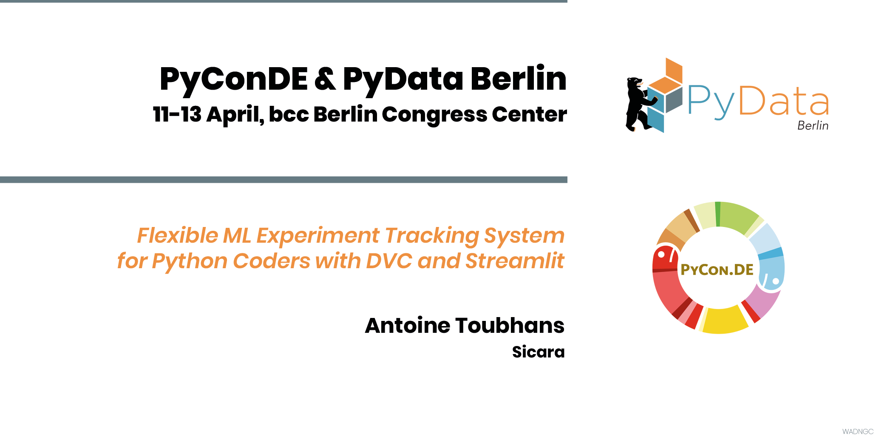
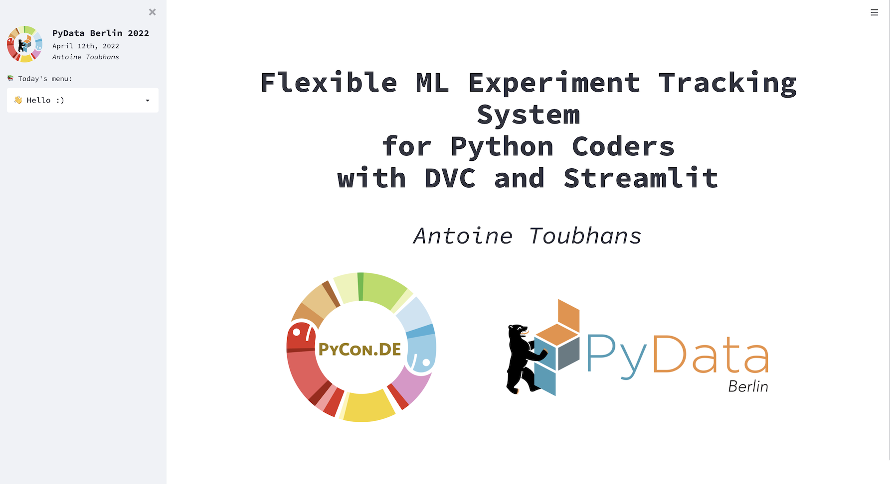

Flexible ML Experiment Tracking System
for Python Coders
with DVC and Streamlit
===



This repo provides the slides and the materials
for [the talk I gave at PyConDE/PyDataBerlin 2022](https://2022.pycon.de/program/WADNGC/), on Tuesday April 12nd.

# 🎤 Watch the slides

I've made the slides with [Streamlit](https://streamlit.io/),
so you need to run some `pip install` before you can see the slides :).

### 1️⃣ Requirements

It works with python 3.9.10 on my laptop.
It should be working with python >=3.6, but I have not tested it though.

### 2️⃣ Installation

```bash
pip install -r requirements.txt
pre-commit install  # You can skip this if you don't intend to make new commits
```


### 3️⃣ Pull the data

```bash
dvc pull -R .
dvc exp pull origin -A
```

### 4️⃣ Start the presentation

Just run:

```bash
streamlit run st_talk_slides.py
```

You should see the first slide with the title:


From there, you can navigate through the slides with the menu in the left sidebar.
Please [open an issue](https://github.com/sicara/pycon-2022-dvc-streamlit/issues/new) if you got trouble with the slides 🙏.

# 🧑‍💻 About the code

I've made the slides with [Streamlit](https://streamlit.io/) for several reasons:
- to show the code and its execution in the slides, to avoid switching to a web browser during the presentation
- to make the slide more interactive
- because the talk was about Streamlit, kind of inception 🌀

I used [streamlit-book](https://streamlit-book.readthedocs.io) for the page layout.
Many thanks [sebastiandres](https://github.com/sebastiandres) for the awesome work 🙏 👍.

### 📂 Project Structure

| Path | Description |
| ------ | ----------- |
| st_talk_slides.py | The main Streamlit script for the slides. |
| ./code_samples | Code samples that were run "as is" in the slides. |
| ./images | The images of the slides. |
| ./src | Source code for the training pipeline: no streamlit here, only Python and DVC |
| ./utils | Utility functions for the slides e.g, display HTML and CSS, command line in Streamlit etc |

### 🧪 Running new experiments

- 1️⃣ Add experiments in the queue. For instance, if you want to change the train seed:
```bash
dvc exp run --set-params train.seed=0106 --queue
```
➡️ you can look at available parameters in the [params.yaml file here](./src/params.yaml)

- 2️⃣ Run the experiments that are in the queue:
```bash
dvc exp run --run-all
```

- 3️⃣ Check the results:
```bash
dvc exp show
```

- 4️⃣ Save the experiments to the remote git server and data storage (requires forking this repo & setting up your own dvc remote):
```bash
git push
dvc exp push origin --rev HEAD
```

> ⚠️ **A note on DVC remote storage**:
> remote storage is [the Sicara's public s3 bucket](s3://public-sicara/dvc-remotes/pycon-2022-dvc-streamlit)
> (see [dvc config file](./.dvc/config)).
> By default, you have permission to read (`dvc pull`) but you cannot write (`dvc push`).
> If you want to run experiments and save your result with `dvc push`,
> consider adding [your own dvc remote](https://dvc.org/doc/command-reference/remote/add).

